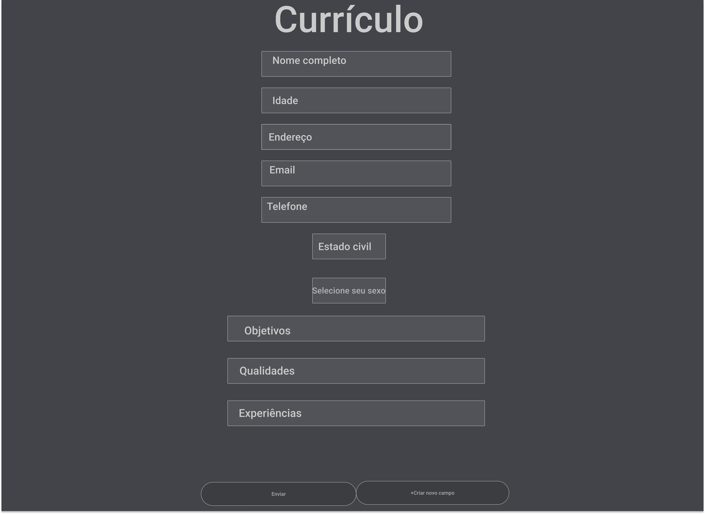

# Gerador de curriculo_

# Introdução

Projeto criado com conhecimento inicial/básico de cada linguagem, para Atividade de Prática Orientada da UNIPAR "Universidade Paranaense"

# Linguagens usadas :
<pre>
.Jquery
.Css 
.Html 
.Php
</pre>

# Protótipo do projeto no Figma

# Guia do Usuário
* ## Etapa 1:  

  baixe todos os arquivos e em seguida, abra o `index.html`

* ## Etapa 2: 
  Preencha todos os campos de texto e em seguida clique no botão `Enviar`

* ## Etapa 3:
  Nesta etapa o curriculo estará formatado e pronto para ser imprimido com o botão `Imprimir`